### Escuela Colombiana de Ingeniería
### Arquitecturas de Software - ARSW

## Escalamiento en Azure con Maquinas Virtuales, Sacale Sets y Service Plans

### Parte 1 - Escalabilidad vertical

1. Creacion de la VM Con los parametros establecidos en Azure:

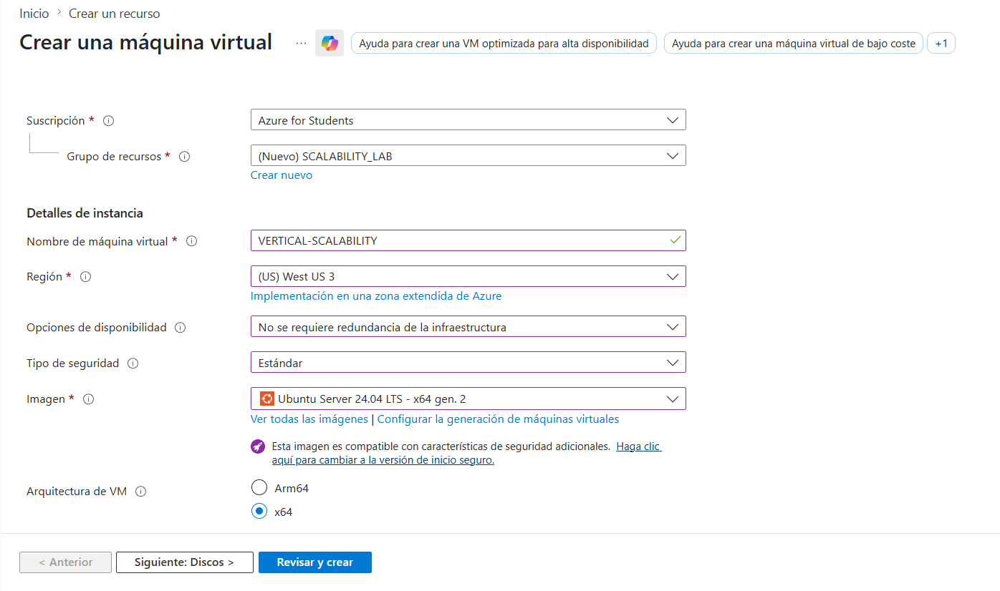
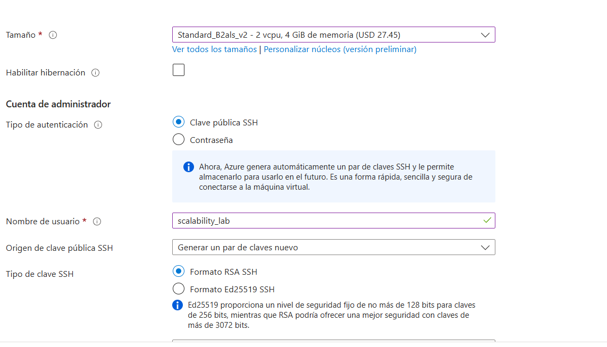
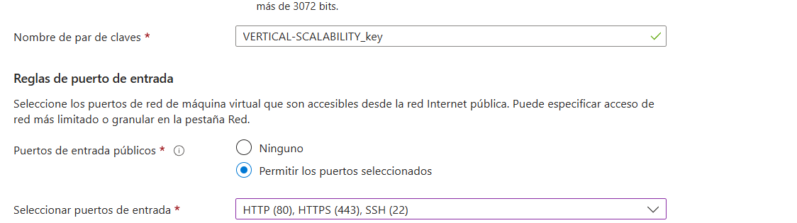
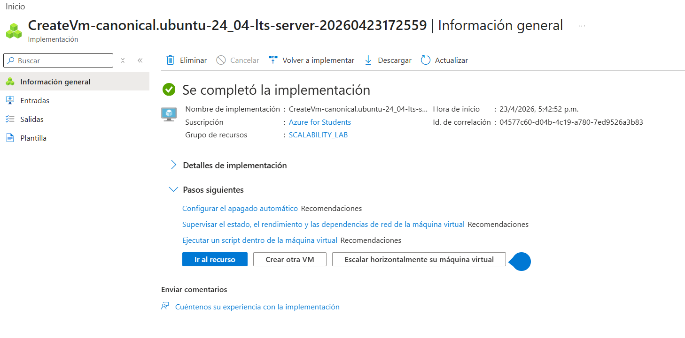


2. Conexion a la VM mediante ssh:

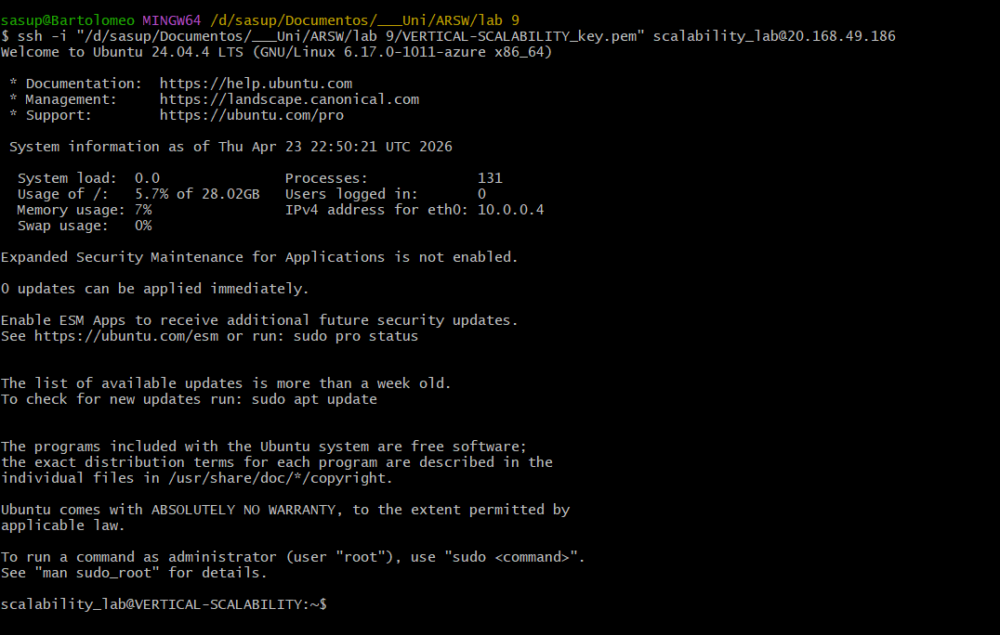

   

3. Instalacion de node
Se uso la guia: https://voidnull.es/instalacion-de-nodejs-en-ubuntu-24-04/

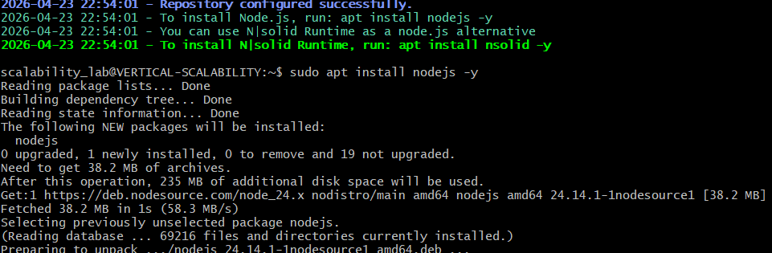
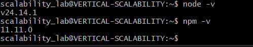


4. Clonar el repositorio e instalar las dependencias

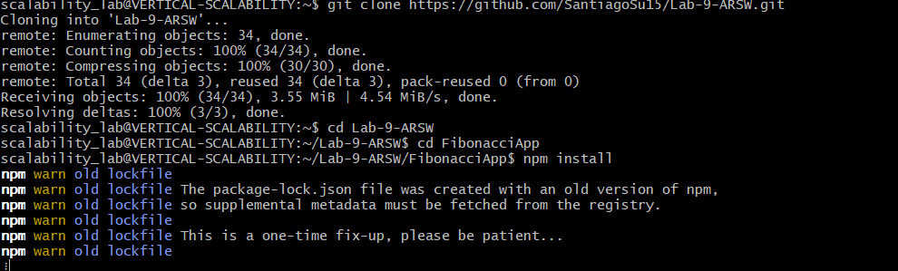


5. Ejecucion de la app

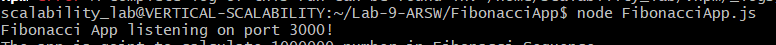


6. Abrir el puerto 3000 en el firewall de la VM para poder acceder al endpoint de la app.

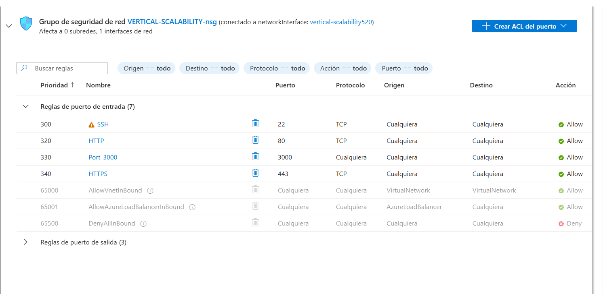
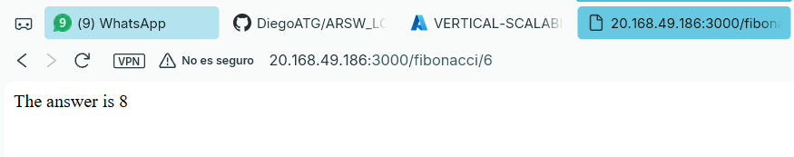


7.  Tabla de tiempos:
    * 1000000
    * 1010000
    * 1020000
    * 1030000
    * 1040000
    * 1050000
    * 1060000
    * 1070000
    * 1080000
    * 1090000   

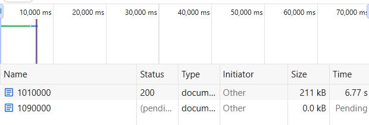


8. Consumo de CPU:

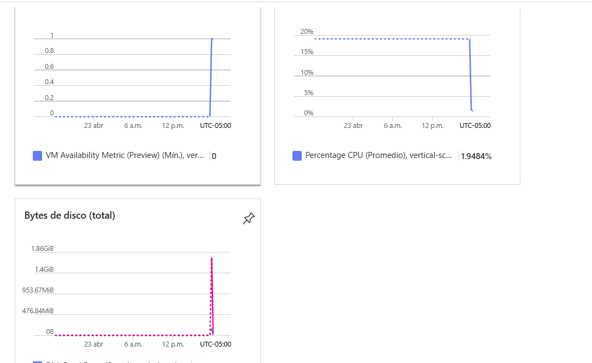

9. Instalacion de newman y ejecucion de las pruebas de carga con el siguiente comando:

    ```
    newman run ARSW_LOAD-BALANCING_AZURE.postman_collection.json -e [ARSW_LOAD-BALANCING_AZURE].postman_environment.json -n 10 &
    newman run ARSW_LOAD-BALANCING_AZURE.postman_collection.json -e [ARSW_LOAD-BALANCING_AZURE].postman_environment.json -n 10
    ```
Cambio por la ip de la maquina virtual:
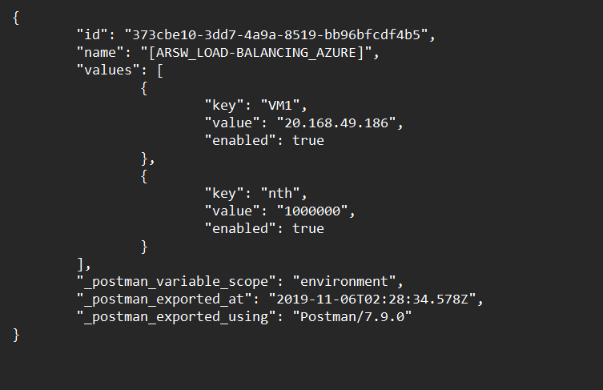
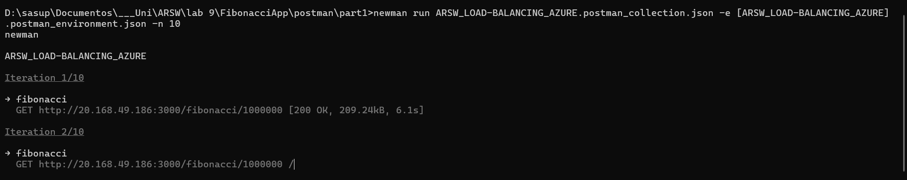
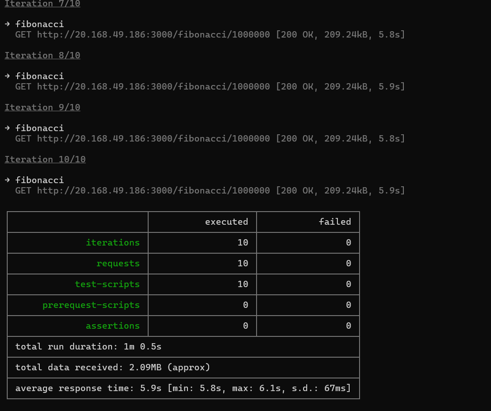


10. Dado que la maquina ya es b2 no se puede hacer escalado vertical como se indica en el lab, se elegio tal maquina desde el inicio dada que era la mas barata disponible

**Preguntas**

1. ¿Cuántos y cuáles recursos crea Azure junto con la VM?
   - Máquina Virtual (VM)
   - Virtual Network (VNet)
   - Subnet
   - Network Interface (NIC)
   - Public IP Address
   - Network Security Group (NSG)
   - Disk (OS Disk)
   - Resource Group (contenedor lógico)


2. ¿Brevemente describa para qué sirve cada recurso?

     - VM: máquina virtual donde se ejecuta la aplicación.
     - VNet: red privada donde se conecta la VM.
     - Subnet: subdivisión de la red para organizar recursos.
     - NIC: interfaz que conecta la VM a la red.
     - Public IP: permite acceso externo a la VM.
     - NSG: controla reglas de entrada/salida (firewall).
     - Disk: almacenamiento del sistema operativo.
     - Resource Group: contenedor que agrupa todos los recursos.
   

3. ¿Al cerrar la conexión ssh con la VM, por qué se cae la aplicación que ejecutamos con el comando `npm FibonacciApp.js`? ¿Por qué debemos crear un *Inbound port rule* antes de acceder al servicio?

   - la ap se cae porque al cerrar SSH se termina la sesión donde se ejecuta el proceso. Esto pasa porque el proceso depende del terminal activo y al cerrar SSH, se envía una señal de terminación.
   - Se debe crear un Inbound Port Rule porque:
      - Por defecto Azure bloquea puertos externos.
      - Es necesario permitir tráfico entrante al puerto donde corre la app
      - Sin esto, aunque la app esté corriendo, no se puede acceder desde el exterior.
     

4. Adjunte tabla de tiempos e interprete por qué la función tarda tando tiempo.
   - La función tarda demasiado porque tiene una implementación ineficiente, esto hace recalculo de valores repetidos y por ende alto  consumo de CPU.


5. Adjunte imágen del consumo de CPU de la VM e interprete por qué la función consume esa cantidad de CPU.
   - Alta cantidad de llamadas recursivas.
   - Repetición de cálculos.
   - Uso intensivo del procesador sin optimización.

   

7. ¿Cuál es la diferencia entre los tamaños `B2ms` y `B1ls` (no solo busque especificaciones de infraestructura)?


8. ¿Aumentar el tamaño de la VM es una buena solución en este escenario?, ¿Qué pasa con la FibonacciApp cuando cambiamos el tamaño de la VM?
   - No por que solo mejora el rendimiento temporalmente no la implementacion inneficiente y en caso de que muchas mas personas hicieran solicutes grandes no es buena opcion estar aumentando la maquina todo el tiempo


9. ¿Qué pasa con la infraestructura cuando cambia el tamaño de la VM? ¿Qué efectos negativos implica?

   - Se reinicia la maquina virtual
   - Se cambia la capacidad
   - Se reasignan recursos fisicos
   - Se pierde la conectividad
   - Costos mayores
   - No mejora la eficiencia del codigo


10. ¿Hubo mejora en el consumo de CPU o en los tiempos de respuesta? Si/No ¿Por qué?
    - No debido que la maquina con la que se inicio era de un mismo tamaño 

   


### Parte 2 - Escalabilidad horizontal

#### Crear el Balanceador de Carga


1. 2. 3. 4.  5. Creacion del balanceador de carga

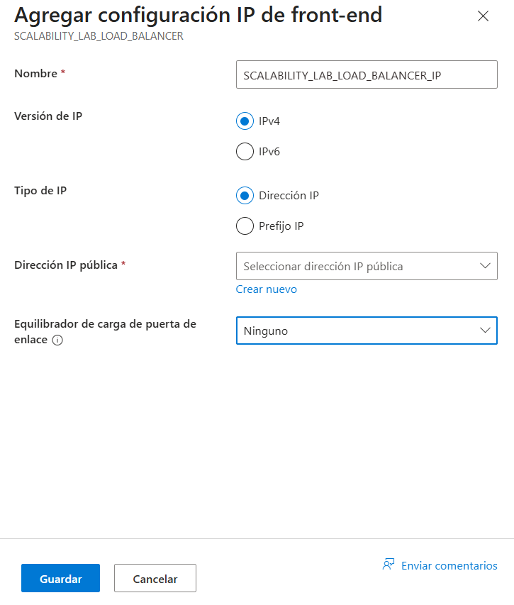
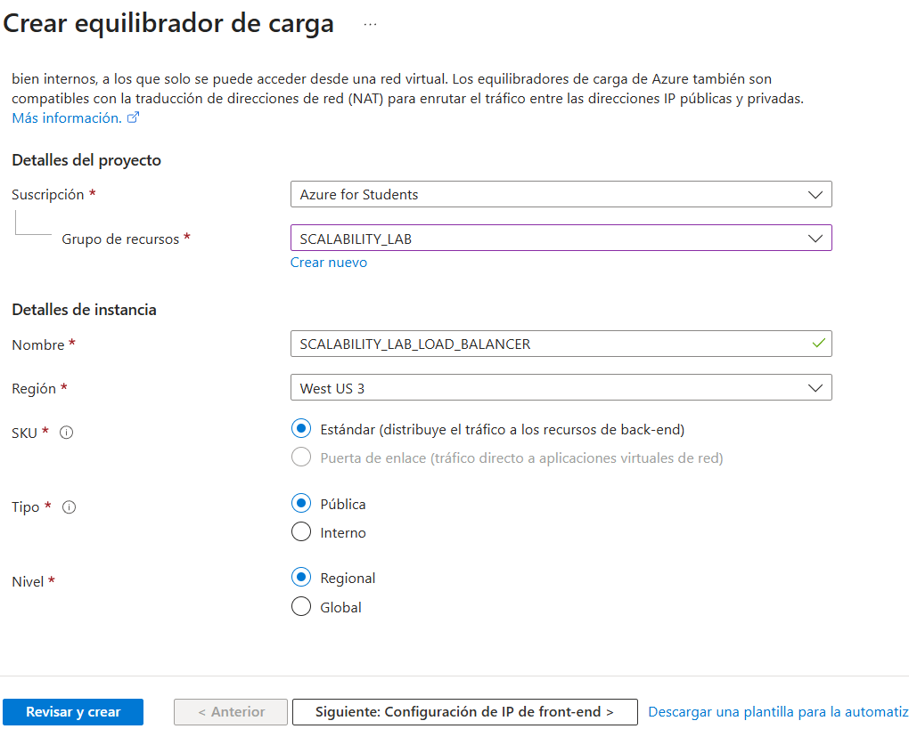
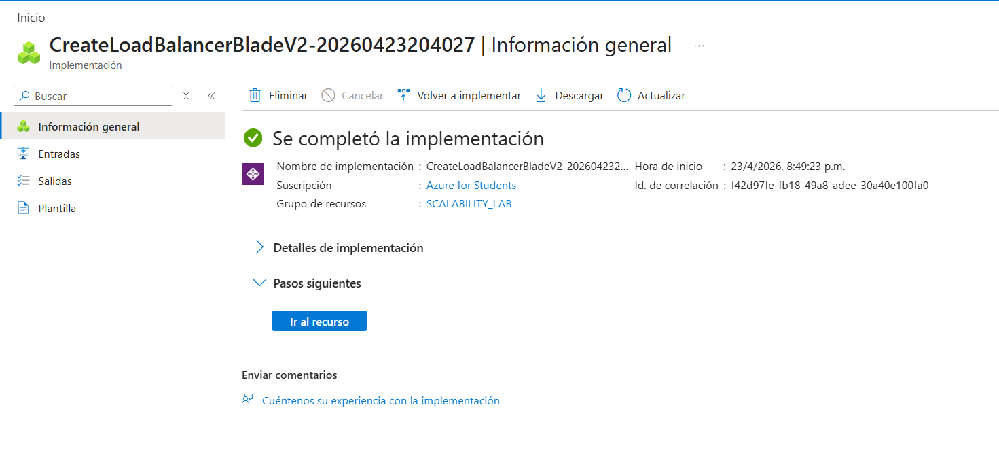
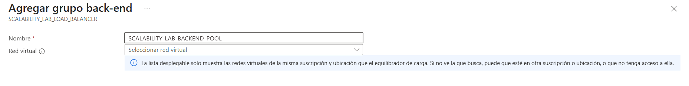
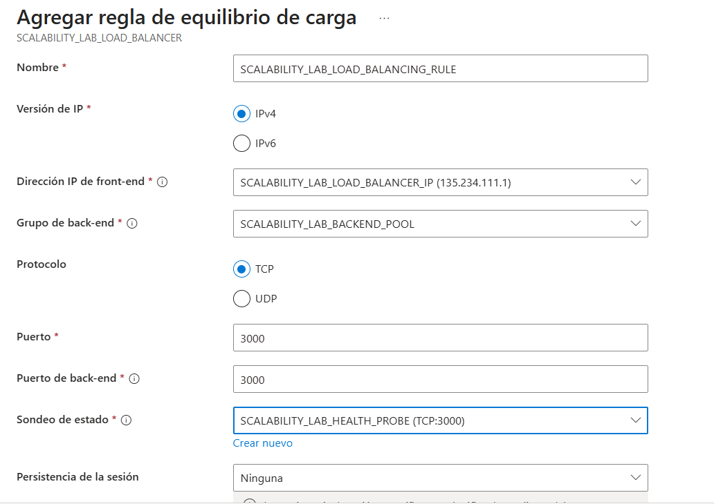
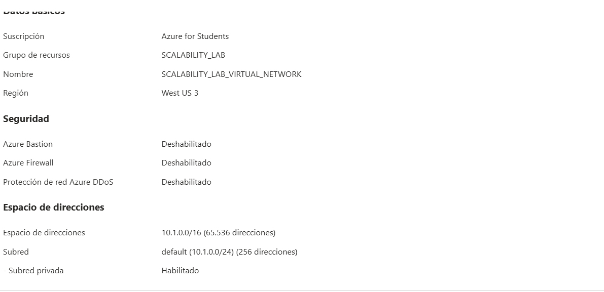


Al oprimir las 3 zonas de disponibilidad se crean 3 vms con las mismas caracteristicacs


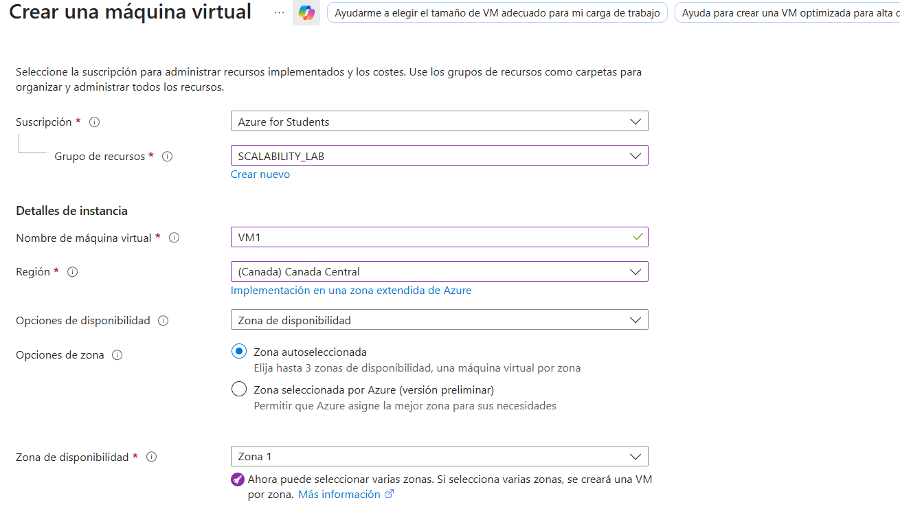
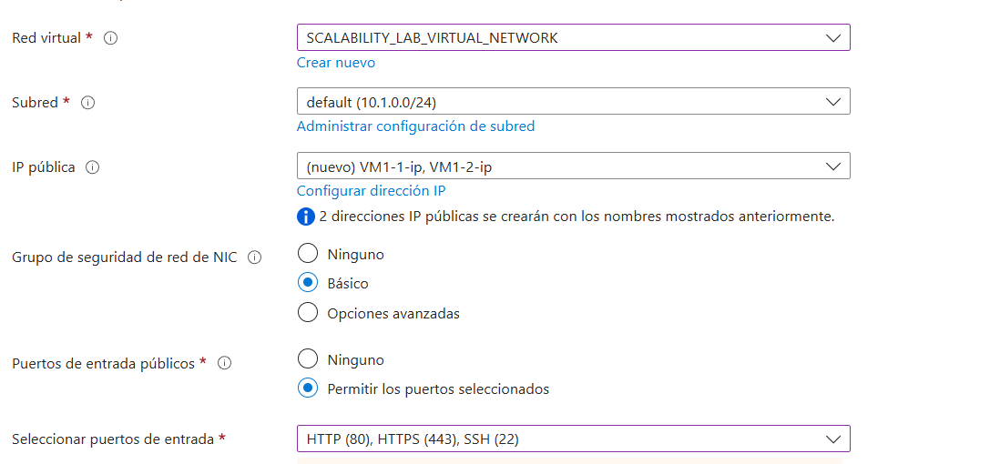
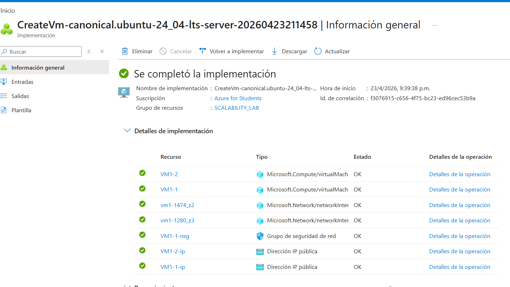


En cada vm se clona el repo y se instala node

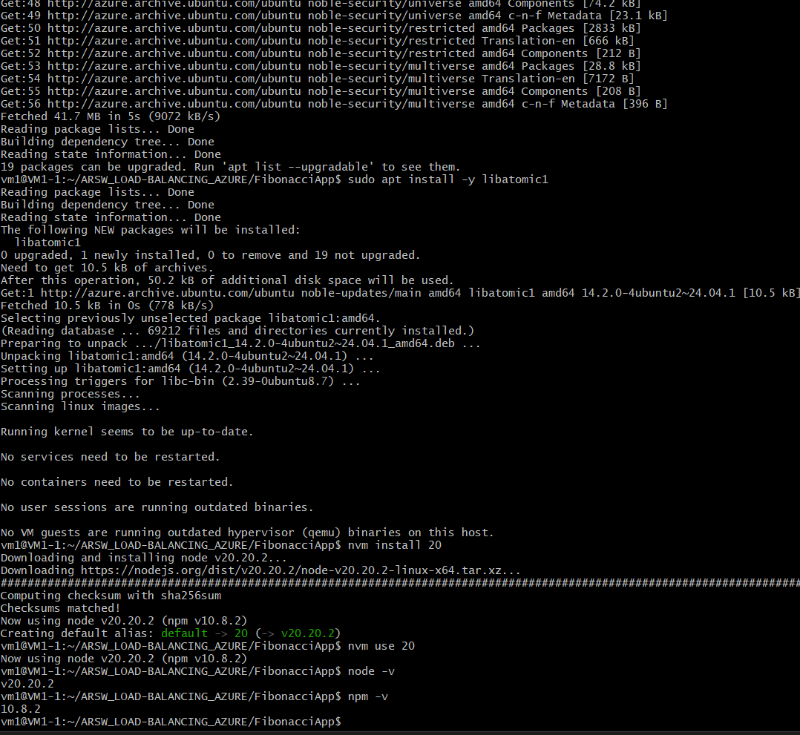
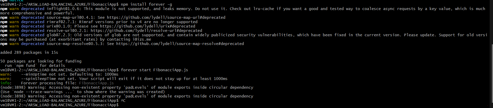


#### Probar el resultado final de nuestra infraestructura

1. Se prueba con la ip del balanceador de carga

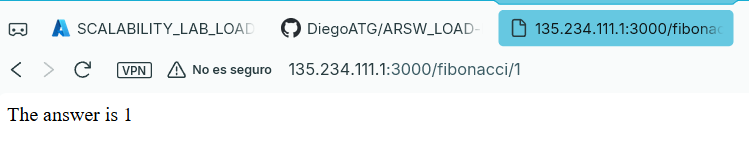


En los json de la parte 2 se agrega el puerto 3000 y se pone la ip

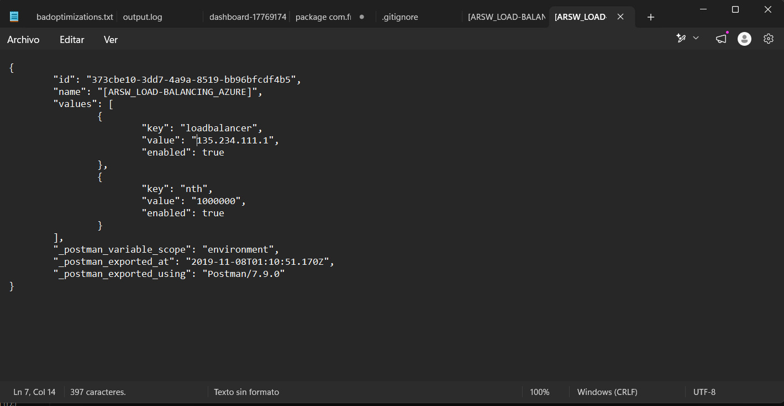


Pruebas newman

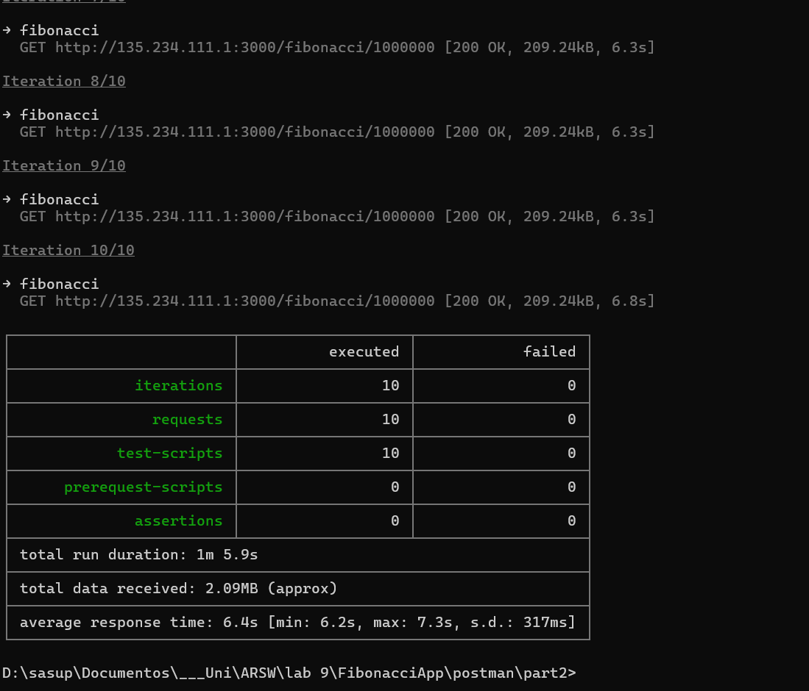


**Preguntas**

* ¿Cuáles son los tipos de balanceadores de carga en Azure y en qué se diferencian?, ¿Qué es SKU, qué tipos hay y en qué se diferencian?, ¿Por qué el balanceador de carga necesita una IP pública?
  - Azure Load Balancer 
  - Application Gateway
  - Azure Front Door
  Cambia dependiendo el uso que se necesite (dependiendo de la capa)
  - SKU: Sock Keeping Unit, en Azure define características y capacidades del recurso.
  El balanceador necesita una ip publica para recibir trafico de internet

    
* ¿Cuál es el propósito del *Backend Pool*?
  - Es el conjunto de recursos que reciben tráfico como lo serian las vms 
  - Mejora la disponibilidad de la app y distribuye carga entre ellas


* ¿Cuál es el propósito del *Health Probe*?
  - Verifica el estado de las instancias, detecta instancias caidas

* ¿Cuál es el propósito de la *Load Balancing Rule*? ¿Qué tipos de sesión persistente existen, por qué esto es importante y cómo puede afectar la escalabilidad del sistema?.
  - Define como el trafico es distribuido entre las instancias
  - Permite la persistencia de la sesion
  - Permite la distribucion de trafico entre las instancias


* ¿Qué es una *Virtual Network*? ¿Qué es una *Subnet*? ¿Para qué sirven los *address space* y *address range*?
  - Una red virtual es un espacio de direcciones privado que se utiliza para conectar recursos de Azure, aisla los recursos para que solo se puedan acceder desde dentro de la red virtual.
  - Una subred es una subdivision de una red virtual.
  - El address space es el espacio de direcciones IP que se asigna a la red virtual.
  - El address range es el intervalo de direcciones IP que se asigna a la subred.
  

* ¿Qué son las *Availability Zone* y por qué seleccionamos 3 diferentes zonas?. ¿Qué significa que una IP sea *zone-redundant*?
    - Las zonas de disponiblidad son centros de datos por region para tener alta disponibilidad y tolerancia a falloss


* ¿Cuál es el propósito del *Network Security Group*?
  - Es el firewall a nivel de red, controla el trafico entrante y saliente de la red virtual.


## Autores

- Santiago Suarez
- Felipe Rangel


